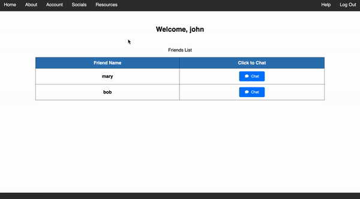
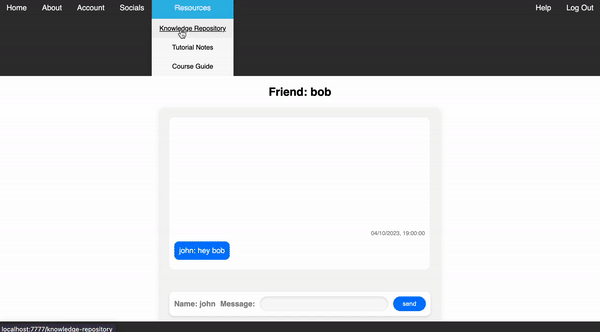
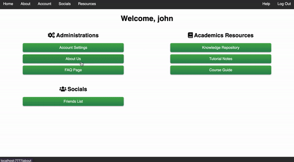

# DiscussionForum

## Instructions 

1. Make sure working director is in "main", otherwise, Run `cd main`. 
2. Run `python3 run.py` in terminal 
3. Go to [this link](http://localhost:7777/) 

## Demo

For Demo video, go to the directory *main/demo* and the video is named "demo.mp4"

Here are some snippets of the application:

- Chat feature

- Other features

